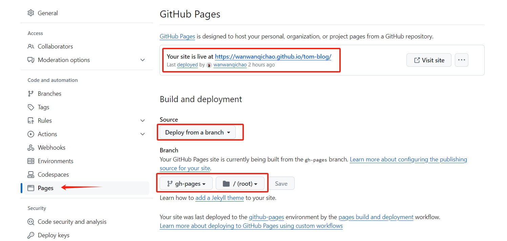
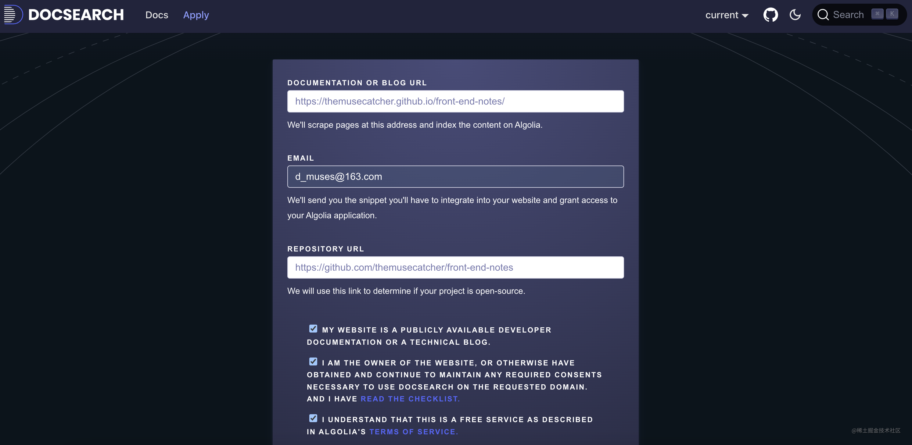

# 打包静态网站并部署到 GitHub

## 编写打包部署脚本

在项目根目录创建 deploy.sh 脚本，用于自动化打包、部署流程

::: details 查看详情
``` sh
# /bin/bash

# 确保脚本抛出遇到的错误
set -e

# 打包生成静态文件
pnpm docs:build

# 进入待发布的 dist/ 目录
cd docs/.vitepress/dist

# 提交打包静态网站到 github-pages 分支
git init
git add .
git commit -m 'deploy'

# 部署到 https://<username>.github.io/<repo>
git push -f [这里是你的项目git地址] master:github-pages

# 提交所有代码到github
cd ../../../
git add .
git commit -m 'update'
git push
```
:::

新增ackage.json运行脚本
``` js
"docs:deploy": "sh deploy.sh"
```

## 配置 github pages



## 配置 Algolia 搜索

[申请搜索服务](https://docsearch.algolia.com/apply/)

填写部署到公网的网站地址、邮箱和代码仓库地址，全部勾选，然后提交



等待申请通过的并回复该邮件
> 回复语句：`I am the maintainer of the website, I can modify the code ~`

等待下一封回复的邮件，该邮件中包含了`appId` `apiKey` `indexName`

在vitePress的配置文件中配置 algolia 搜索服务
``` js
import { defineConfig } from 'vitepress'

export default defineConfig({
  themeConfig: {
    algolia: {
      appId: 'xxx',
      apiKey: 'xxx',
      indexName: 'xxxd'
    }
  }
})
```